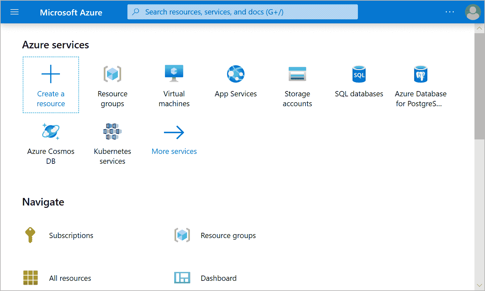
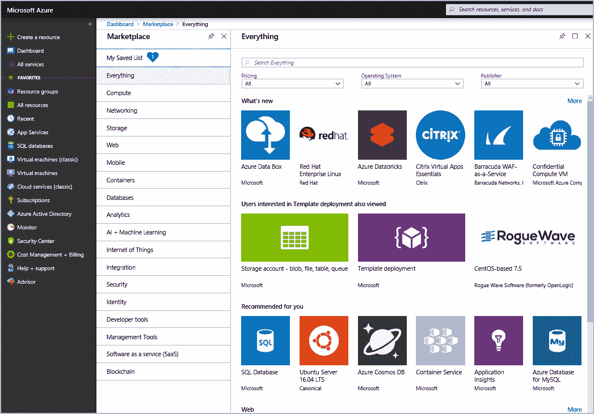
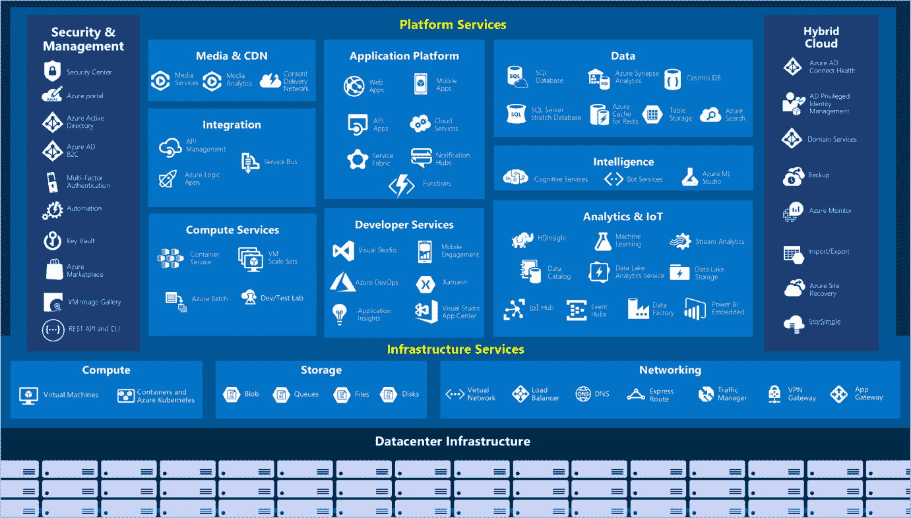

# 蔚蓝基础

> 原文：<https://www.javatpoint.com/azure-fundamentals>

Azure 是一个云计算平台，拥有一组不断扩展的服务，可帮助您构建解决方案来满足您的业务目标。Azure 服务范围广泛，从简单的 web 服务到运行虚拟化计算机来运行您的定制软件解决方案。Azure 提供了许多基于云的服务，如远程存储、数据库托管和集中式帐户管理。Azure 还提供了人工智能和**物联网** (IoT)等新功能。

在本模块中，您将从入门级端到端的角度来看 Azure 及其功能。通过可用的学习途径，您将获得 Azure 基础知识的坚实基础。

### 什么是 Azure 基本面？

Azure foundation 是一系列六种学习途径，向您介绍 Azure 及其许多服务和功能。

无论您是否有兴趣了解云安全最佳实践，即 Azure 在计算网络、存储和数据库服务方面的核心，或者探索物联网和机器学习的前沿，请查看我们精心策划的 Azure 指南。

Azure 基础包括交互式练习，让您亲身体验 Azure。许多练习提供了一个名为沙盒的临时 Azure 环境，允许您自由地按照自己的节奏学习。

不需要技术信息技术经验；然而，掌握一般的信息技术知识将帮助你充分利用你的学习经验。

### 为什么要考 Azure 基本面？

无论您是刚刚开始使用云，还是已经有了云体验并且对 Azure 还不熟悉，Azure foundation 都能为您提供开始使用所需的一切。

无论你的目标是什么，Azure 基本面都有适合你的东西。如果您:

*   对 Azure 或云有普遍的兴趣。
*   想获得微软官方认证。

Azure 基础知识学习路径系列可以帮助您准备 AZ-900 考试:微软 Azure 基础知识。该考试涵盖六个知识领域:

**AZ-900 域区域**

描述云概念

20-25%

描述核心 Azure 服务

15-20%

描述 Azure 上的关键解决方案和管理工具

10-15%

描述一般安全和网络安全功能

10-15%

描述身份、治理、隐私和法规遵从性特征

20-25%

描述 Azure 成本管理和服务级别协议

10-15%

每个领域领域映射到 **Azure 基础中的学习路径。**

百分比显示了考试中每个领域的相对权重。百分比越高，这部分考试的问题就越多。请务必阅读考试页面，了解每个领域涉及哪些技能的具体信息。

本次培训有助于您全面了解 Azure。拥有真实世界的经验将有助于强化概念，以便你为考试或在工作中应用你的技能做好充分准备。

### 什么是 Azure？

Azure Cloud 是一套不断扩展的服务，可帮助您的组织应对当前和未来的业务挑战。Azure 让您可以使用自己选择的工具和框架，在广阔的全球网络中自由地构建、管理和部署应用程序。

### Azure 提供了什么？

有了 Azure，您就拥有了构建下一个伟大解决方案所需的一切。下表列出了 Azure 为使用 Objective 轻松开具发票提供的诸多优势。

**为未来做好准备:**微软不断的创新，支撑着你今天的成长，支撑着你明天的产品愿景。

**建立在你的条件上:**你有选择。通过对开源的承诺和对所有语言和框架的支持，您可以随心所欲地构建和部署。

**无缝操作混合动力:**内部、云中和边缘-我们将在您所在的位置与您会面。使用专为混合云解决方案设计的工具和服务来集成和管理您的环境。

**信任您的云:**在专家团队的支持下，从底层获得安全性，并获得企业、政府和初创公司信任的主动合规性。

### 我可以用 Azure 做什么？

Azure 提供了 100 多种服务，使您能够完成从在虚拟机上运行现有应用程序到探索新的软件范例(如智能机器人和混合现实)的所有工作。

许多团队开始探索云，将他们现有的应用程序转移到运行在 Azure 中的虚拟机上。将您现有的应用程序迁移到虚拟机是一个好的开始，但是云不仅仅是运行虚拟机的单独场所。

例如，Azure 提供人工智能和机器学习服务，通过视觉、听觉和语音与用户自然交流。它还提供了可动态增长以容纳大量数据的存储解决方案，而 Azure 服务支持的解决方案如果没有云的力量是不可能实现的。

### 什么是 Azure 门户？

Azure Portal 是一个基于网络的集成控制台，它提供了命令行工具的替代方案。使用 Azure 门户，您可以使用图形用户界面管理您的 Azure 订阅。您可以这样做:

*   构建、管理和监控从简单的网络应用到复杂的云部署的一切。
*   为有组织的资源视图创建自定义仪表板。
*   配置辅助功能选项以获得最佳体验。

Azure 门户旨在实现灵活性和持续可用性。它在每个 Azure 数据中心都保持存在。这种配置使 Azure 门户能够抵御孤立的数据中心故障，并通过更靠近用户来防止网络变慢。Azure 门户不断更新，维护活动不需要任何停机时间。

### 什么是 Azure 市场？

Azure 市场帮助用户与微软合作伙伴、独立软件供应商和初创公司建立联系，提供定制的解决方案和服务以在 Azure 上运行。Azure Marketplace 客户可以从数百家领先的服务提供商那里找到、尝试、购买和供应应用程序和服务。所有解决方案和服务都经过认证，可以在 Azure 上运行。

解决方案目录涵盖多个行业类别，如开源容器平台、虚拟机映像、数据库、应用程序构建和部署软件、开发人员工具、威胁检测和区块链。

使用 Azure 市场，您可以快速可靠地提供在您的 Azure 环境中托管的完整解决方案。在撰写本报告时，有 8000 多份名单。

Azure Marketplace 是为对商业和 IT 软件感兴趣的 IT 专业人员和云开发人员设计的。微软合作伙伴还将其作为所有联合走向市场活动的启动点。

### 蔚蓝服务之旅

Azure 可以帮助您应对严峻的业务挑战。您带来了您的需求、创造力和喜爱的软件开发工具。Azure 带来了一个庞大的全球基础架构，您可以随时在其上构建应用程序。

让我们快速浏览一下 Azure 提供的高端服务。

### 蔚蓝服务

这是 Azure 中可用的服务和功能的大图。

让我们仔细看看最常用的类别:

*   建立关系网
*   仓库
*   可动的
*   资料库
*   网
*   物联网
*   大数据
*   纳秒
*   DevOps

计算服务通常是公司转向 Azure 平台的主要原因之一。Azure 为托管应用程序和服务提供了许多选项。以下是 Azure 中计算服务的一些示例。

*   Azure 虚拟机:在 Azure 中托管的 Windows 或 Linux 虚拟机(虚拟机)。
*   Azure 虚拟机扩展集:扩展到 Azure 中托管的 Windows 或 Linux 虚拟机。
*   Azure Kubernetes 服务:运行容器化服务的虚拟机的集群管理。
*   Azure 服务结构:在 Azure 或内部运行的分布式系统平台。
*   Azure 批处理:并行和高性能计算应用程序的托管服务。
*   Azure 容器实例:容器化应用程序在 Azure 上运行，无需配置服务器或虚拟机。
*   Azure 函数:事件驱动的无服务器计算服务。

### 建立关系网

连接计算资源并提供对应用程序的访问是 Azure Networking 的核心功能。Azure 中的网络功能包括一系列选项，用于将外部世界连接到全球 Azure 数据中心的服务和功能。

以下是 Azure 中网络服务的一些示例。

*   Azure 虚拟网络:将虚拟机连接到传入的虚拟专用网络(VPN)连接。
*   Azure 负载平衡器:平衡应用程序或服务端点的入站和出站连接。
*   Azure 应用网关:优化应用服务器场交付，同时提高应用安全性。
*   Azure VPN 网关:通过高性能 VPN 网关访问 Azure 虚拟网络。
*   Azure DNS:提供超快的 DNS 响应和超高的域可用性。
*   Azure 内容交付网络:向全球客户交付高带宽内容。
*   Azure DDoS 保护:保护 Azure 托管的应用程序免受分布式拒绝服务(DDoS)攻击。
*   Azure 流量管理器:在全球 Azure 区域分配网络流量。
*   Azure 快速路由:通过高带宽专用安全连接连接到 Azure。
*   Azure 网络观察器:通过使用基于场景的分析来监控和诊断网络问题。
*   Azure 防火墙:实现具有无限可扩展性的高安全性、高可用性防火墙。
*   Azure 虚拟广域网:创建连接本地和远程站点的统一广域网。

### 仓库

Azure 提供四种主要类型的存储服务。

*   Azure Blob 存储:非常大的对象的存储服务，如视频文件或位图。
*   Azure 文件存储:可以像文件服务器一样访问和管理的文件共享。
*   Azure 队列存储:用于在应用程序之间对消息进行排队和可靠分发的数据存储。
*   Azure 表存储:表存储是一种在云中存储非关系型结构化数据(也称为结构化 NoSQL 数据)的服务，提供了一种无模式设计的键/属性存储。

所有这些服务都有几个共同的特点:

*   **耐用的**和高可用性的冗余和复制。
*   **通过自动加密和基于角色的访问控制保护**。
*   **可扩展的**具有几乎无限的存储空间。
*   **管理、**维护和处理任何对你重要的问题。
*   它可以通过 HTTP 或 HTTPS 从世界任何地方访问。

### 移动的

借助 Azure，开发人员可以快速轻松地为 iOS、Android 和 Windows 应用构建移动后端服务。过去需要花费时间并增加项目风险的功能，如添加公司登录和连接到内部资源，如 SAP、Oracle、SQL Server 和 SharePoint，现在很容易包括在内。

**该服务的其他功能包括:**

*   离线数据同步。
*   与内部数据的连接。
*   广播推送通知。
*   自动缩放以满足业务需求。

### 数据库ˌ资料库

Azure 提供了几种数据库服务来存储各种各样的数据类型和卷。通过全球连接，用户可以立即获得这些数据。

*   Azure 宇宙数据库:支持 NoSQL 选项的全球分布式数据库。
*   Azure SQL 数据库:完全管理的关系数据库，具有自动扩展、整体智能和强大的安全性。
*   MySQL 的 Azure 数据库:完全管理和可扩展的 MySQL 关系数据库，具有高可用性和安全性。
*   PostgreSQL 的 Azure 数据库:完全管理和可扩展的 PostgreSQL 关系数据库，具有高可用性和安全性。
*   Azure 虚拟机上的 SQL Server:一项服务正在云中托管企业 SQL Server 应用程序。
*   Azure Synapse Analytics:全面管理的数据仓库，在每个级别都具有整体安全性，无需额外成本。
*   Azure 数据库迁移服务:将数据库迁移到云中而无需更改任何应用程序代码的服务。
*   Redis 的 Azure Cache:完全托管的服务缓存经常用于减少数据和应用程序延迟以及静态数据。
*   MariaDB 的 Azure 数据库:完全管理和可扩展的 MariaDB 关系数据库，具有高可用性和安全性。
*   Web:在当今的商业世界中，拥有良好的 web 体验非常重要。Azure 包括对构建和托管网络应用程序和基于 HTTP 的网络服务的一流支持。以下 Azure 服务专注于网络托管。

### 描述

*   **Azure 应用服务:**快速打造强大的云网应用。
*   **Azure 通知中枢:**从任意后端向任意平台发送推送通知。
*   **Azure API 管理:**安全、大规模地向开发人员、合作伙伴和员工发布 API。
*   **Azure 认知搜索:**将这种完全托管的搜索部署为服务。
*   **Azure 应用服务的网络应用功能:**大规模创建和部署任务关键型网络应用。
*   **天青信号服务:**轻松添加实时网页功能。
*   **IoT:** 人们可以获得比以往更多的信息。个人数字助理导致了智能手机，现在有了智能手表、智能恒温器，甚至智能冰箱。个人电脑曾经是常态，现在互联网允许任何支持在线的对象访问有价值的信息。设备收集并传递信息进行数据分析的能力称为物联网。

### 许多服务可以帮助并推动 Azure 上物联网的端到端解决方案。

物联网中央

全面管理的全球物联网**软件即服务(SaaS)** 解决方案使大规模连接、监控和管理物联网资产变得容易。

**蓝色物联网中枢**

消息中心，提供数百万物联网设备之间的安全通信和监控。

物联网边缘

全面管理的服务允许将数据分析模型直接推送到物联网设备，使它们能够对状态变化做出快速反应，而无需咨询基于云的人工智能模型。

**大数据:**数据有各种形式和大小。当我们谈论大数据时，我们谈论的是巨大的数据量。来自天气系统、通信系统、基因组研究、成像平台和许多其他场景的数据会产生数百千兆字节的数据。这种数据量使得分析和决策变得困难，而且数据量往往如此之大，以至于传统形式的处理和分析不再适用。

* * *