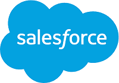
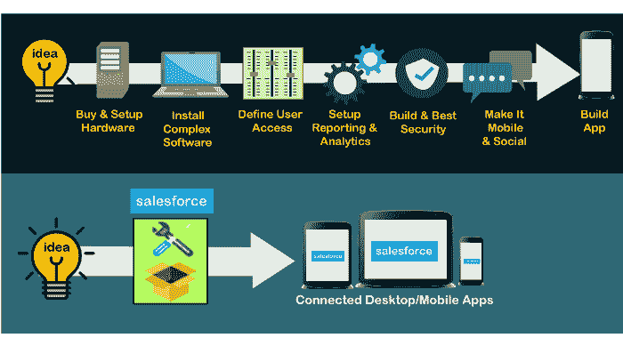

# Salesforce 教程

> 原文：<https://www.javatpoint.com/salesforce>

Salesforce 是最好的基于云的 CRM 平台之一。它是一个集成的客户关系管理平台，为组织内的所有部门(如营销、销售、商务和服务)提供每个客户的单一共享视图。我们的 salesforce 教程旨在帮助初学者使用 Salesforce，并通过高级概念帮助专业人员了解基本概念。在本文中，我们将涵盖 Salesforce 从开始到 Apex 开发的所有基本主题。

## 什么是 Salesforce？

*   Salesforce 是一个 **SaaS 或软件即服务**，这意味着不需要安装软件或服务器来工作。用户只需在 Salesforce.com 注册，就可以立即开始运营业务。
    T3】
*   它是由马克·贝尼奥夫、帕克·哈里斯、戴夫·莫伦霍夫和弗兰克·多明格斯在 1999 年创立的。
*   Salesforce 最初是一个 CRM 软件，但今天它为用户和开发人员提供各种产品和软件解决方案。
*   由于 Salesforce 是基于云的软件，因此它不需要任何 it 专业人员来设置任何东西。
*   它提供了通过单一集成环境与客户、业务合作伙伴和客户联系的最佳方式之一。它允许企业识别客户的需求，轻松解决问题，并在最短的时间内提供相同的解决方案。

在深入学习本教程之前，让我们先了解一下 Salesforce 的两个基本概念: **CRM 和云计算**。

## 客户关系管理

[CRM](salesforce-crm) 代表**客户关系管理**，一个管理所有客户和公司互动的软件。它包含并管理所有与客户相关的信息，如客户名称、*地址、电话号码、电子邮件地址和其他与业务相关的信息。该软件保留了与客户的所有互动、客户登记的投诉、行政人员提供的解决方案以及特定业务或产品的其他客户活动*。

它还允许我们跟踪和管理提供给客户的销售、营销和潜在客户。

## 云计算

云计算是一种存储、管理、处理和访问互联网的**技术，而不是本地服务器或计算机硬盘**。

借助云计算，一个组织可以节省大量的本地数据存储、数据维护等成本。借助互联网，可以从任何地方更高效地访问云上的信息。

使用云计算代替传统存储有助于用户获得许多好处，如**速度、成本效益、安全性、全局访问等**。

#### 注意:在下一个主题中，我们将学习云计算的详细介绍。

## 销售队伍的历史

以下是 Salesforce 自成立以来多年发展过程中的一些里程碑:

*   salesforce 的开发始于 1999 年，由马克·贝尼奥夫、帕克·哈里斯、弗兰克·多明格斯和戴夫·莫埃伦霍夫共同开发，他们对 Salesforce 的客户关系管理有着相同的愿景。
*   2001 年，salesforce 公司宣布全球扩张，同年超过 3000 家客户，成为发展最快的 CRM 公司。
*   2003 年，第一次梦想力量活动在旧金山举行。在这一事件中，第一个按需应用服务 sForce2.0 已经启动。
*   2005 年，Salesforce 推出了 **AppExchange** 服务。该服务旨在为第三方开发人员提供一个平台来开发他们的应用程序，并将这些应用程序提供给 salesforce 客户。
*   2008 年，一个允许开发人员构建应用程序的 salesforce 开发平台“force . com-**”发布。**
*   2011 年，公司推出了**Chatter**——面向企业的社交协作服务。
*   2013 年，它推出了 Salesforce1 平台，使客户能够通过手机开展业务。
*   2014 年，该公司推出了 **Trailhead** ，这是一个赋予任何人学习新技能的平台。
*   2015 年，Salesforce 成为**财富 500 强企业**之一。
*   2019 年，该公司收购了 **Tableau** ，于是全球排名第一的 CRM 和排名第一的分析平台走到了一起。

## 为什么选择 Salesforce？

在上一节中，我们已经了解了 Salesforce，但是我们为什么要选择它呢？有什么好处？以下几点解释了选择 Salesforce 的好处:

*   选择 Salesforce 的第一个好处是，我们不需要安装任何软件来构建应用程序或运行我们的业务活动。我们可以专注于构建应用程序，而不是安装、设置、修复等。
*   由于它是基于云的客户关系管理平台，任何用户都可以使用互联网从任何地方访问它。
*   任何新用户或初创企业都可以选择 Salesforce 来构建应用程序或运营业务，因为它价格合理，功能丰富。
*   人们可以很容易地将 Salesforce 与任何第三方应用程序集成，例如 Gmail，这比其他客户关系管理软件容易得多。
*   它是世界上排名第一的客户关系管理软件，因为它易于使用，可以快速部署任何应用程序，并根据要求提供高效的输出。
*   开发成本也很少。

### 销售人员使用的技术

*   **Apex:** Salesforce 有自己的编程语言，被称为 Apex。因此，要成为 salesforce 开发人员或创建 salesforce 应用程序，用户必须对 Salesforce Apex 有很好的了解。
*   **VisualForce:** Visualforce 是 Salesforce 引入的框架，它使开发人员能够创建可以在照明平台上工作的自定义用户界面。
*   **编译器:** Salesforce 包含自己的编译器来编译 Apex 程序和 VisualForce Pages。

## 使用销售力量的公司

如今，有多个大品牌和新的初创企业将 Salesforce 平台用作 CRM 软件和其他服务。以下是一些在业务中使用 Salesforce 的热门公司列表:

1.  **HCL 技术**使用 Salesforce CRM 进行数据输入，以验证客户数据。
2.  **Pizza Hu** t 正在使用 marking salesforce 云为其客户提供智能移动体验。
3.  **欧莱雅**利用 Salesforce 构建了一个社交网络，通过该网络，他们可以与发型师或顾客分享任何与头发时尚相关的计划或活动。
4.  **美国运通**从 2010 年开始使用 Salesforce 云，现在他们可以在整个组织内或从任何地方与员工连接在一起。
5.  **尼康仪器**为自己的业务选择了 Salesforce CRM，但后来，他们也开始使用 Chatter 提供的社交网络。
6.  **康卡斯特-旁观者**使用 salesforce 平台管理客户档案，帮助他们更有效地识别客户兴趣和营销。
7.  **索尼**使用 Salesforce 服务云与客户进行连接。所有的客户投诉都得到管理和处理，以使客户满意。

其他公司，如**城市阶梯、InMobi、Paytm、Genesys 等**。，使用 Salesforce 服务促进业务增长。

## 销售人员客户关系管理与动态客户关系管理的区别

在当今的市场中，各种公司都在为客户提供 CRM 解决方案，如 **SAP、甲骨文、微软 dynamics，包括 Salesforce** 。在所有这些 CRM 解决方案公司中，Salesforce 和 Microsoft Dynamic 之间存在着巨大的竞争。让我们来看看这两种客户关系管理解决方案的区别:

| 能力 | 评论 | 微软动态 |
| **部署选项** | Salesforce 提供仅在云上部署选项。 | 微软动态客户关系管理可以部署在云上、内部或合作伙伴托管。 |
| **语言界面** | 与微软动态相比，Salesforce 提供的语言支持有限。 | 它为客户提供 35 种语言支持。 |
| **可达性** | 它提供了从任何地方访问网络和移动应用的能力。 | 它还提供了从任何地方访问其网络和移动应用的途径。 |
| **储存** | 它为 1 到 20 个用户提供 1GB/用户存储。 | 它为 1 到 20 个用户提供 10GB 共享存储。 |
| **定价** | 它的定价为每个用户每月 25-300 美元。 | 它的定价为每个用户每月 65-135 美元。 |

## 观众

本 salesforce 教程旨在帮助初学者、云计算爱好者和开发人员学习针对各种业务需求的 Salesforce CRM 软件。

## 先决条件

在学习 salesforce 教程之前，以下先决条件至关重要:

*   要完全理解 Salesforce 及其架构，必须对**云计算**有一个基本的了解。
*   了解如何存储、检索和管理客户数据还需要了解**数据库存储**的知识。

## 问题

我们向您保证，在学习我们的 salesforce 教程时，您不会发现任何困难。但是如果本教程有任何错误，请将问题或错误张贴在联系表中进行改进。

* * *