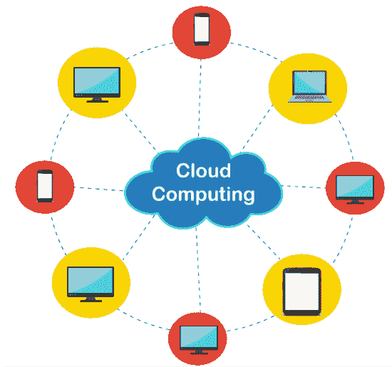
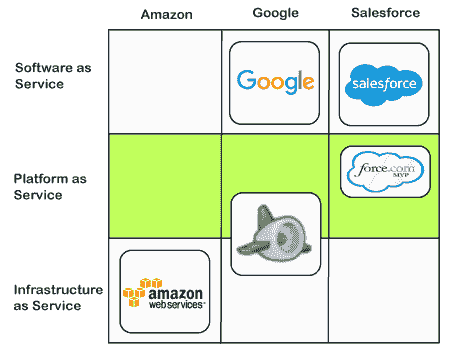
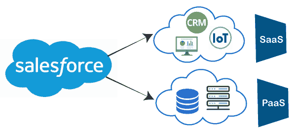

# 云计算概述

> 原文：<https://www.javatpoint.com/salesforce-overview-of-cloud-computing>

Salesforce 是领先的云计算平台之一，通过云向其客户和合作伙伴提供服务。为了更好地理解 salesforce 的概念，必须学习 salesforce 背后的基本概念，即云计算。在这个主题中，我们将了解云计算的所有基础知识。

### 什么是云计算？

***云计算是一种通过互联网而不是本地服务器或计算机硬盘来存储、管理、处理和访问数据的技术*** 。这里，术语云取自流程图中互联网用户的符号。**远程服务器**用于云计算，存储可以通过互联网从任何地方访问的数据。

借助[云计算](https://www.javatpoint.com/cloud-computing-tutorial)，组织可以节省大量本地数据存储、数据维护等成本。借助互联网，任何人都可以随时随地访问云上的信息。

使用云计算代替传统存储有助于用户获得很多好处，如**速度、成本效益、安全性、全局访问**等。

云计算涉及两个主要概念:

*   **在云上提供软件应用的厂商**。
*   **通过云访问软件应用的客户端**。

## 云服务的类型

云计算通过互联网提供 IT 服务。这些服务被放置在不同的偏远地方。这些服务可分为三大类:

1.  **软件即服务(SaaS)**
2.  **平台即服务(PaaS)**
3.  **基础设施即服务(IaaS)**

**从上述**三项服务中，salesforce 向其用户提供了两项服务: **SAAS** 和 **PAAS。**

### 软件即服务

*软件即服务是通过互联网提供应用即服务的一种方式*。 [SaaS](https://www.javatpoint.com/software-as-a-service) 服务可以使用互联网直接访问，而不是在本地驱动器或系统上安装每个应用程序。

**Salesforce.com**是为 CRM 提供各种在线应用的 SAAS 服务商。不需要在本地机器上安装任何软件或服务器；相反，我们可以通过唱赞歌来开始创业。

### PAAS(Force.com)

[平台即服务](https://www.javatpoint.com/platform-as-a-service)或 PaaS 是一种云计算服务，其中服务提供商(如 Salesforce.com)为其客户提供一个工作平台。在这样的平台上，用户或客户端可以在没有任何信息技术基础设施的情况下运行、开发、测试或管理任何业务应用。

它位于 SaaS 和 IaaS 服务之间，为我们创建解决方案提供了基础。

**谷歌应用引擎**就是 PaaS 服务的一个很好的例子。目前，它提供在线 Python 和 Java 运行时平台来开发网络应用程序，而不需要任何复杂的软件&硬件。

**Force.com**平台也提供 PaaS 服务。它使用自己的专有语言。

### 基础设施即服务

是一种云计算服务，提供租赁计算基础设施。云提供商提供各种基础设施服务，如服务器、虚拟机、网络存储等。

这些服务可以根据客户需求进行扩展和缩减。

## 云计算的优势

1.  **性价比:**云计算平台的性价比要高得多，因为不需要在本地驱动器或任何硬件设置上保存数据。
2.  **24*7 可用性:**云计算最显著的优势之一就是可以随时随地访问云中可用的数据或任何服务。
3.  **高安全性:**存储在硬盘中的数据可能会丢失，如果数据高度机密，会对任何组织产生很大影响。但是有了云平台，数据在云中高度安全，因此云计算降低了数据丢失的风险。
4.  **轻松访问:**可以随时随地访问云应用。
5.  **快速实现:**要实现任何新的应用程序，可能需要很长时间。但是有了云应用，这个时间可以减少很多。对于大多数云应用程序，我们只需要注册，就可以开始工作了。
6.  **即时可扩展性:**基于云的应用程序使组织能够根据需求轻松增加或减少用户数量。因此，我们不需要考虑可用性或容量不足。
7.  **自动更新:**任何应用程序升级、维护或测试应用程序都可能需要很多天。但是对于云应用程序来说，这样的事情是没有必要的，因为云应用程序有可以自动更新的自动更新软件。
8.  **协作:**云计算增强协作。这意味着一个组织的各种团体可以在云平台上虚拟连接并共享有用的信息和数据。它改善了任何组织的客户服务和产品开发流程。

* * *