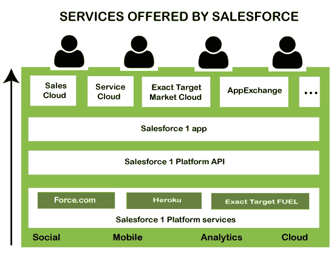
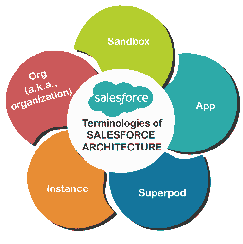
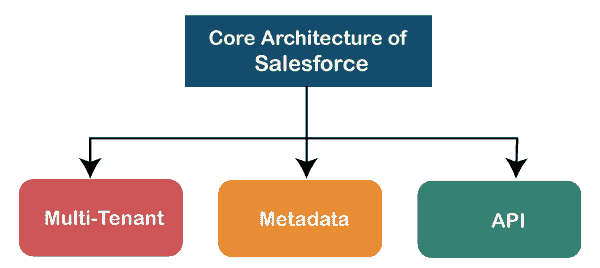
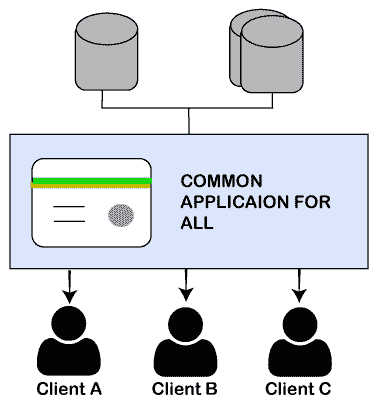
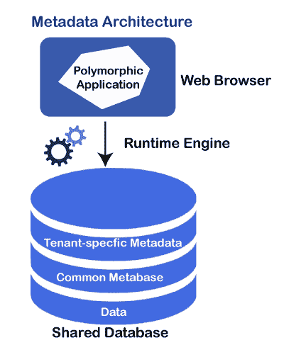

# 销售力量架构

> 原文：<https://www.javatpoint.com/salesforce-architecture>

Salesforce 是领先的客户关系管理平台之一，为其客户、合作伙伴和员工提供各种定制服务。它还提供了构建定制应用程序、页面、组件等的平台。，它如此高效地执行所有这些任务，主要是因为它遵循的体系结构。

*Salesforce 架构是多层架构；它包含一系列位于彼此顶部的层。*

下图显示了 salesforce 的体系结构视图:

**sales force 架构说明**

*   在多层 salesforce 架构中，用户位于最顶层。
*   用户可以访问用户层下面的一层，这意味着 salesforce 提供的各种云，如*销售云、服务云、AppExchange、*等。
*   第三层是 **salesforce1 App** ，允许用户在移动设备上访问 salesforce。
*   最后一层包含其他各种 salesforce 平台，如**Force.com、Heroku、Exact TargetFuel** 等。

## Salesforce 体系结构中使用的术语

*   **App:** 架构中的一个 App，可以让我们直观的收集各种东西。元数据元素，如类、对象、视觉力等。，都不同于 App 而独立。
*   **实例:**salesforce 架构的一个实例是当用户登录 sales force 系统时出现在用户面前的软件配置。它显示了它所工作的特定 salesforce 组织的服务器详细信息。许多 salesforce 实例可以存在于单个服务器上。但是，它基于用户的位置，并根据用户位置而变化。
*   **superpad:**superpad 是框架和堆栈平衡器的集合。它包括出站中介服务器、系统和容量基础、邮件服务器、存储区域网络纹理以及支持多个实例的各种其他框架。它在数据中心内提供服务隔离，因此，如果一个共享组件出现问题，它可能不会影响每个实例。
*   **组织:**组织或组织是 salesforce 应用程序的特定客户。当新用户在 saleforce.com 或 developer.force.com 开始试用时，它会在系统中生成一个新的组织。该组织拥有可定制的安全和共享设置，可以根据需要进行定制。单个组织可以在任何地方为任何用户提供支持，无论是多个授权的个人用户帐户、门户用户帐户还是 Force.com 站点用户帐户。
*   **沙盒:**沙盒是生产的实例。它包含样本数据而不是原始数据。沙箱允许开发人员测试开发的各种条件，以实现客户对应用程序的期望。使用沙箱，开发人员可以在不同的环境中创建生产组织的多个副本。

## 销售队伍的核心架构

salesforce 的架构可以理解为一系列层。架构的每一层都有不同的特性和功能。每一层描述如下:

## 1.多租户层

Salesforce 架构之所以如此受欢迎，是因为它的**多租户**。*多租户架构是指**多个组或客户端的一个通用应用程序**T5。在这样的架构中，多个客户端使用同一个服务器，但是它们的 oak 是相互隔离的。这意味着一个客户端的数据是安全的，并且与其他组或客户端隔离。*

由于多租户，任何开发人员都可以开发应用程序，将其上传到云上，并轻松地与多个客户端或组共享。多个用户共享同一个服务器和应用程序，因此非常划算。在 salesforce 中，由于这种多租户架构，所有客户的数据都保存在一个数据库中。

从上图中我们可以看到，公共应用程序在三个客户端之间共享。

多租户架构比单租户架构高效得多。这两种架构之间的一些差异如下:

*   单租户架构的开发成本比多租户架构高得多，因为在单租户架构中，应用程序上的每个用户和维护成本也归单个用户所有。
*   要在应用程序中进行任何更新，开发人员需要手动为每个客户端进行更新。而在多租户中，开发人员需要在一个地方完成，每个客户端将自动收到更新的版本。

## 2.[计]元数据

Salesforce 平台遵循元数据开发模型。元数据意味着关于数据的数据。Salesforce 将元数据与数据一起存储在共享数据库中。这意味着它存储数据以及数据的作用。

如下图所示，特定于租户的数据确保公共数据只与一个租户共享，而不是与另一个租户或组共享。这确保了即使在共享数据库中数据的安全性。多租户架构解决了安全问题，因为所有数据都以元数据的形式存储在不同的级别，即数据之上的数据。

我们可以将它理解为一个例子，例如如果有三个客户端 A、B 和 C 包含 salesforce 平台中的共享数据库。这些组可以从共享数据中访问它们的元数据。因此，每个客户端都有单独的元数据。这种独立的元数据确保每个客户端只共享自己的数据，而不共享其他数据。这提高了共享数据库的安全性和开发人员的工作效率。

### 应用编程接口服务

salesforce 元数据驱动模型允许开发人员在各种工具的帮助下轻松创建他们的应用程序。但是有时候开发者需要更多的功能来修改他们的应用程序。为了进行这样的修改，salesforce 提供了强大的 API 来源。这些应用编程接口帮助开发人员定制 Salesforce 移动应用程序。这些应用编程接口允许编程的各个部分相互接口并交换数据。在不知道很多细节的情况下，我们可以将我们的应用程序与其他应用程序连接起来。

该应用编程接口提供了一种简单但功能强大且开放的方式来以编程方式访问数据和 salesforce 平台上运行的任何应用程序。这些应用编程接口帮助开发人员从任何位置访问应用，使用任何支持网络服务的编程语言，如 [Java](https://www.javatpoint.com/java-tutorial) 、 [PHP](https://www.javatpoint.com/php-tutorial) 、 [C#](https://www.javatpoint.com/c-sharp-tutorial) 或[。NET](https://www.javatpoint.com/net-framework) 。

* * *