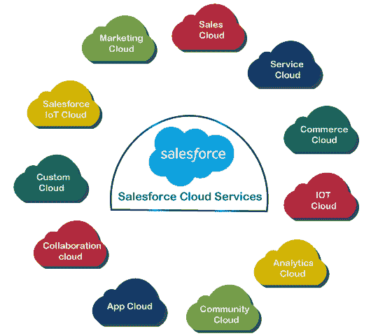

# Salesforce 产品-销售人员提供的服务

> 原文：<https://www.javatpoint.com/salesforce-dot-com-offerings-services-by-salesforce>

Salesforce 提供了大量的服务和产品，为了更好地了解 salesforce 平台，我们必须了解它提供了哪些不同的产品和服务。Salesforce.com 提供一组客户关系管理服务或产品，旨在适应组织的各个方面。

salesforce 提供的一些流行云服务和产品包括:

*   **销售云**
*   **营销云**
*   **分析云**
*   **社区云**
*   **商业云**
*   **服务云**
*   **App 云**
*   **协作云**
*   **自定义云**
*   **Salesforce 物联网云**

让我们讨论每一个。

### Salesforce 销售云

*   销售云是 Salesforce.com 平台提供的服务，是 salesforce CRM 系统的一部分。
*   它帮助公司支持销售，并为企业对企业和企业对客户的业务提供营销和客户支持。
*   **Salesforce 自动化**是一种流行的销售工具，帮助企业提高销售过程的速度，并简化导致现金。根据 Salesforce.com，超过 82，400 个客户正在使用超过 135，000 个应用程序，使全球数百万用户能够更有效地管理资源和流程。
*   它还使企业能够在更短的时间内处理更多的业务，更紧密地合作，并使用 SFA 尽早完成交易。
*   这是 Salesforce 完全可定制的云服务，可在一个位置集成所有客户相关信息。
*   它包括**营销、销售、线索生成、客户服务、业务分析等。**，还通过 AppExchange 提供对各种其他应用程序的访问。如需了解更多信息，请点击此处(Salesforce 销售云)。

### Salesforce 服务云

*   服务云是为客户提供服务和支持的平台。
*   服务云是一个优秀的客户服务平台，可以使用任何可能的平台，如*电话、电子邮件、即时消息、推特、脸书或其他社交平台*，提供更快、更个性化的服务。
*   借助服务云，客户可以从任何平台获得客户支持，并根据自己的需求获得支持。要了解更多信息，请点击此处(销售人员服务云)。

### Salesforce 协作云

*   与 Chatter 的协作云是 Salesforce 最近发布的版本。
*   salesforce chatter 服务允许用户通过跟踪其他用户、文档和数据来更有效地协作，这些对他们来说是至关重要的实时更新源。
*   基于**组织范围的安全和共享模型**，允许用户创建和设置组和配置文件，以增强跨多个业务应用程序的协作，并且还确保用户只能看到他们有权访问的信息。

### Salesforce 定制云

*   定制云是 Salesforce.com 的一个根本性转变。
*   Salesforce 不仅仅是一个 CRM 平台，我们还可以利用其 PaaS 服务开发几乎任何应用程序。但是问题出现了，为什么我们需要在 Force.com 平台上构建下一个应用程序？因此，答案是，使用传统软件的企业应用程序开发变得过于复杂、缓慢和昂贵。但是在 Force.com 平台上的应用程序开发比在传统的设备平台上构建要快得多，成本也低得多，并且可以生成更高质量的应用程序。
*   根据这位行业专家的说法，由于云计算的存在，在 Force.com 平台上构建应用程序要快 5 倍，并且需要更少的成本。以下是使用它的一些好处:
    1.  提供更快的价值实现时间
    2.  它不需要前期资本支出
    3.  它降低了运营成本
    4.  与其他技术相比，它需要更少的技术资源
    5.  简化集成

### Salesforce 营销云

*   每个公司都使用多种营销活动来做广告和发展业务。
*   营销活动包括*内容管理、内容营销、数据分析、内容构建、网页个性化、客户影响力、电子邮件、移动、社交媒体活动*等。
*   Salesforce 的营销云服务提供了最好的数字营销平台之一，可以增强任何公司的营销策略。它允许组织只需点击一下，就可以向各种潜在客户发送定制的大量电子邮件。
*   它还有助于解决与任何产品相关的客户问题。组织可以增加与任何定制社区的沟通，并通过脸书、推特等社交媒体平台与客户联系。

### Salesforce 分析云

*   分析云服务为客户提供商业智能平台。
*   它帮助客户轻松处理全面的数据。它还通过包含图形、图表和其他图形表示改进了数据可视化。
*   我们还可以将分析云服务与 Salesforce 提供的服务相集成。

### Salesforce 商业云

*   salesforce 商业云服务是关于客户服务和体验的。
*   它允许公司在线或店内为客户提供最好的服务和体验。
*   它集成了客户数据，以提供更好的客户体验。
*   它旨在为公司提供最好的、积极的、吸引人的客户体验。要了解更多信息，请单击此处(Salesforce 商业云)。

### Salesforce 应用云

*   Salesforce 应用云提供了一个平台来构建可以在 Salesforce 平台上运行的定制应用。
*   可以假设它是构建、发现和运行任何定制应用程序的生态系统。它提供了多种开发工具，有助于构建定制应用程序。应用云的一些工具包括:
    *   **Force.com**
    *   **AppExchange**
    *   **英雄库**
    *   **Salesforce 雷霆**
    *   **Salesforce 沙盒**

### Salesforce 社区云

*   社区云服务提供了一个平台来维护员工、客户和销售或业务合作伙伴之间的沟通。
*   它还使客户能够实时共享数据和图像。
*   它允许组织直接与客户联系，提高合作伙伴的成功率，并提高员工的工作效率。
*   社区云允许企业为每个用户提供个性化的体验。客户可以找到社区来有效地解决他们的问题或查询。

### Salesforce 物联网云

*   物联网可以通过不同的设备、网站、应用、传感器等产生海量数据。
*   物联网云平台可以接收这些数据，它允许我们开始处理这些数据，以生成实时响应。
*   IOT 云服务提供了一个存储和处理物联网数据的平台。

* * *