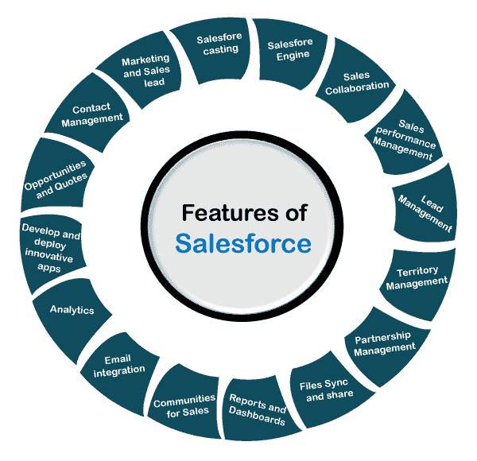

# 销售队伍的特点

> 原文：<https://www.javatpoint.com/features-of-salesforce>

Salesforce 最初是一个 CRM(客户关系管理)平台，但现在已经扩展到各个领域的服务，从人工智能到物联网。Salesforce 功能涵盖了业务的所有方面，如销售线索管理、电子邮件集成、销售协作等。在本主题中，我们将讨论 salesforce 的流行功能。

以下是 Salesforce 的一些流行功能:

### 1.客户和联系人管理

Salesforce 的客户和联系人管理功能提供了每个客户的完整信息。它包括每个客户的 ***活动历史、与客户的沟通、关键联系人**等。简单来说就是包含了所有与客户沟通相关的信息*。

### 2.机会管理

它使我们能够管理与销售团队的所有销售交易，并与完成每笔交易所需的人员和信息保持联系。它还包括每笔交易的阶段，以及我们需要采取什么行动来赢得具体的交易。

### 3.销售人员参与

Salesforce engage 功能允许我们与销售人员分享营销内容，以增强公司的销售能力。它就像一座桥梁，填补了销售和营销之间的空白。它根据与客户的互动提供实时销售警报。

### 4.销售协作

销售协作功能允许销售团队与 Salesforce 中强大的社交工具协作。它还有助于找到销售专家，在团队中共享竞争数据等。，从任何地方发展业务。它允许销售团队在各种销售机会上合作，并从任何地方检查进度。

### 5.销售绩效管理

销售绩效管理主要分为薪酬管理，因软件工具不同而有所不同。这改善了销售过程的日常执行。它为团队提供了基于指标的目标设置，并为销售团队提供持续的反馈和奖励。

### 6.领导管理

销售线索管理软件解决方案通过提供营销活动如何影响销售渠道的信息来帮助企业。首先，将我们的时间投入到关键和热门的交易中会有所帮助。

### 7.Salesforce 移动应用程序

Salesforce 移动应用程序使我们的移动设备成为便携式销售办公室。它允许我们 ***打电话，回复每一个热点线索，工作机会，以及从任何地方看到棋盘*** 。我们可以通过一个应用程序管理会议、活动和帐户更新。[借助 Salesforce 移动应用程序，可以从任何地方访问和更新 Salesforce CRM](salesforce-crm) 。

### 8.工作流和批准

它允许我们使用可视工作流的拖放选项来设计和自动化任何业务流程。它为销售折扣、费用等提供了灵活的审批流程。它允许业务流程自动完成。

### 9.文件同步和共享

借助文件同步和共享功能，我们可以轻松共享文件、协作处理这些文件、发布最佳内容，并实时跟踪所有这些活动。我们可以很容易地从任何地方找到任何文件或内容，因为所有内容都放在同一个地方。它通过发布最相关和最准确的内容来消除销售过程中的错误。

### 10.销售预测

此功能可帮助您获得整个团队预测的实时观察结果。我们还可以跟踪领导委员会，以了解目标的最佳表现者。它提供了业务的完整视图，以便我们可以在必要时采取必要的行动。

### 11.报告和仪表板

仪表板提供了一目了然的业务实时视图。它允许我们在没有任何 It 人员帮助的情况下创建销售预测报告。

### 12.电子邮件集成

Salesforce 电子邮件跟踪软件可以与 Outlook CRM 和 Gmail 集成，以同步联系人、事件和所有内容，从而更快地工作。在 Salesforce lightning 的帮助下，我们可以轻松地将我们的重要电子邮件即时同步到 Salesforce，并且它还提供了已连接客户的完整视图。salesforce 电子邮件编辑器可帮助我们随时随地撰写并向任何重要联系人发送电子邮件。

### 13.区域管理

区域管理有助于构建销售区域的逻辑结构，以便向正确的客户提供正确的销售并获得最大利润。它使我们能够复制区域模型，以安全地找到新的替代方案，例如新的分配规则、层次结构等。我们可以对多个地区应用单一规则。

### 14.合作伙伴管理

合作伙伴管理层使用 Salesforce CRM 应用程序快速构建合作伙伴生态系统。它通过**招聘、培训和支持间接销售渠道**来提高合作伙伴在我们业务中的参与度。它让合作伙伴的销售过程变得更加容易和快速。

* * *