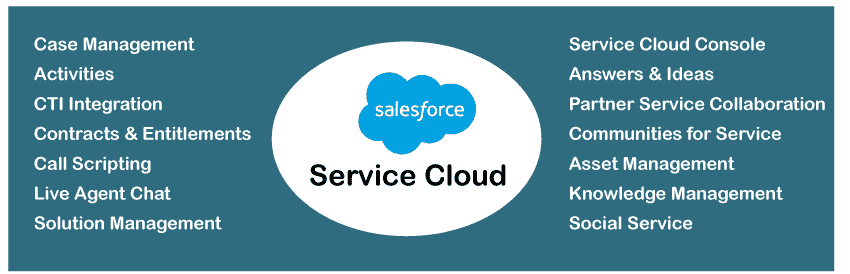
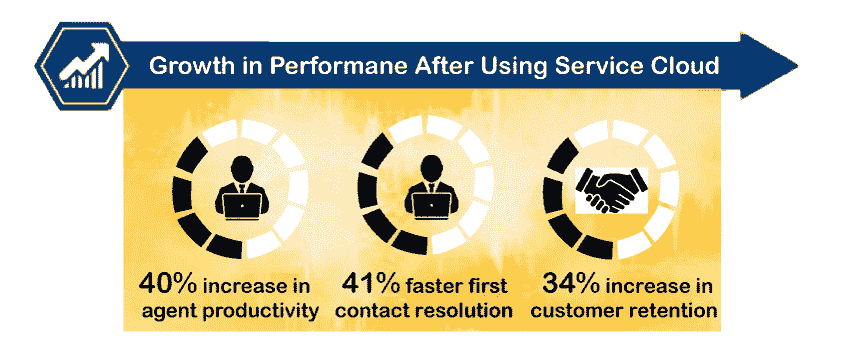

# Salesforce 服务云

> 原文：<https://www.javatpoint.com/salesforce-service-cloud>

*   Salesforce 服务云是为客户提供服务和支持的客户关系管理平台。
*   服务云是一个很好的客户服务平台，几乎可以通过任何可能的平台，如*电话、电子邮件、即时消息、推特、脸书或其他社交平台*提供快速和更个性化的服务。
*   借助服务云，客户可以从任何平台获得客户支持并获得支持。

*   Salesforce 服务云为企业提供了更重要的服务，有助于扩大维护和消费者满意度。它帮助企业通过不同的渠道解决客户问题和需求。
*   Salesforce 服务云是一项 SaaS 服务，建立在 Salesforce 客户成功平台之上。它提供客户的 360 度视角，为客户提供更智能、更快捷、更个性化的服务。
*   服务云建立在不同的销售力矩阵上，例如**日均案例、按问题列出的案例、每个客户的解决时间**等。

## 销售队伍服务云的需求

在上一节中，我们了解了什么是服务云，但是为什么组织应该选择它。因此，答案是，如果一个组织关心其客户服务，那么它必须选择 Salesforce 服务云。在每个领域，无论是 B2B(企业对企业)还是 B2C(企业对客户)，公司都会得到以票据形式出现的客户问题或查询。

服务代理收到这些票据，需要在固定的时间内解决，以提供最佳的客户支持。Salesforce 服务云使组织能够高效地跟踪、解决和关闭这些票证。

以下是使用 Salesforce 服务云的一些基本优势:

*   **提高代理的工作效率**
    借助服务云，代理可以从任何地方登录和工作，因为可以从任何设备访问 salesforce 服务控制台，例如基于网络的应用程序或移动设备。它提高了代理的工作效率，客户查询可以在分配的时间内得到解决。
*   **高效的案件追踪**
    代理追踪案件的效率越高，案件解决的速度就越快。使用服务云，代理可以轻松跟踪案例，减少任何案例的重复或人为错误。
*   **与社交媒体平台**
    融合使用服务云功能，代理商还可以在推特、脸书等社交媒体平台上与客户互动。它有助于建立和保持客户满意度。
*   **数据安全**
    有了服务云，客户数据、交互或任何其他数据都是完全安全的。它遵循多层方法来保持关键信息更加安全。
*   **最佳客户体验**
    使用服务云，公司可以通过提供客户和代理之间的一对一实时通信来增强最佳客户体验。它还有助于提高客户满意度、忠诚度和客户保留率。

## Salesforce 服务云的特性

Salesforce 服务云提供各种服务和功能。这些功能可能因 Salesforce 版本而异。企业版和性能版提供全套功能。这里我们讨论服务云的一些流行特性:

1.  **照明服务控制台:**它通过将所有需要的客户信息放在一个地方，提供统一的体验，最大限度地提高代理的工作效率。有了照明服务控制台，代理商可以快速获得每个客户的相关信息，如档案、案例记录、通信等。，到仪表板；在一个地方。服务云控制台在一个屏幕上提供每个案例的集成视图。这是每个服务代理的个人工作空间，他们可以在这里搜索案例历史，对任何案例做出响应，并与客户无缝沟通。
2.  **案例管理**
    在每个公司，客户都需要帮助。客户可能会面临一些问题，合规、评论或查询，这些问题可以很快解决。但是，如果客户对产品或服务有任何问题，可能会因失去该客户而损害业务。因此，需要快速跟踪和解决客户的问题。Salesforce 中的这些客户问题记录被称为**案例**。
    借助*案例管理功能*，公司可以高效地记录、跟踪和解决客户问题。它允许我们从客户电子邮件或网络表单中生成案例。这些案例可以在不同的队列中进行管理。为了解决这些案例，Salesforce 中还定义了不同的分配和升级规则。
3.  **活动**
    Salesforce 中的任务被称为 sales force 中的活动。这些活动包含与任何案例或任何其他 salesforce 标准或自定义对象相关的用户优先级和分配。
4.  **CTI 集成或呼叫中心**
    Salesforce 服务云支持使用计算机电话集成(CTI)系统将第三方电话系统与 salesforce CRM 集成，以开发行业领先的呼叫中心。它通过提供客户交互的完整视图来帮助服务代理，例如 ***弹出来电窗口、自动拨号和其他电话控制选项*** 。它增强了客户体验和满意度。
5.  **合同和权利**
    服务云的这一特性有助于确定并确保与客户达成各种合同和权利。它包含各种服务合同的记录，如*保修、订阅、维护协议时间段*等。，与产品的特定客户帐户相关。它有助于验证客户是否有资格获得服务&支持，以及他们是否正在接受他们签约的服务。
6.  **知识库**
    知识库功能是为客户提供高效服务和支持的在线图书馆。在知识库的帮助下，代理可以快速回答客户的查询。代理可以查找、复制/粘贴答案来解决任何客户查询。
    Salesforce 知识库是一个强大的集成工具，允许公司为客户查询提供最相关的答案。
7.  **直播代理聊天**
    直播代理聊天功能是在线服务云工具，允许客户通过网站与服务代理进行交流。这是 Salesforce 服务云最受欢迎和最常用的功能。
8.  **全渠道**
    全渠道功能帮助商家利用各种沟通渠道与客户沟通。*代理可以通过网络、电子邮件、电话、移动直播代理、社交媒体和视频聊天*进行交流。omnichannel 可帮助企业将案例从任何渠道发送给适当的代理。它通过自动将案例与具有解决这些案例的最佳技能的适当代理进行匹配来提供智能服务。
9.  **想法和答案**
    通过想法和答案功能，服务云为代理商、客户、内部员工和合作伙伴提供了一个工具，让他们提供任何新想法、回答问题、讨论问题并进行相应的投票。
10.  **社交客服**
    社交客服通过推文、脸书帖、Instagram 等社交渠道管理、监控、创建案例。这也有助于通过社会渠道解决这些案件。
11.  **服务流程和自动化**
    有了服务流程和自动化，您可以通过自动化内部服务流程来节省时间。它包括批准任何任务，以便可以进一步处理。
12.  **资产和订单管理**
    该功能允许企业在一个地方跟踪客户的资产、订单和支持历史。代理可以获得客户活动和订单的完整视图。
13.  **客户和联系人管理**
    客户和联系人管理功能帮助企业保存过去与客户进行的所有通信的关键数据。因此，如果客户提出任何投诉，代理商可以为他们提供满意的解决方案。

* * *