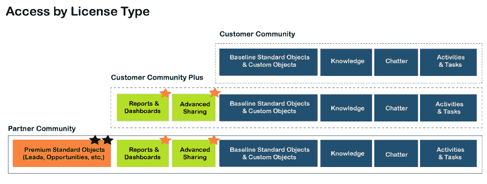
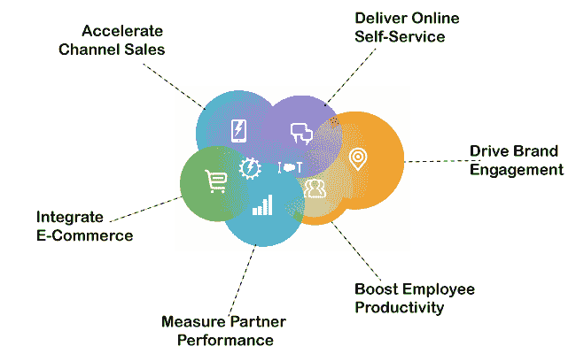

# Salesforce 社区云

> 原文：<https://www.javatpoint.com/salesforce-community-cloud>

*   社区云服务提供了一个平台来保持员工、客户和销售或业务合作伙伴之间的沟通。它还使客户能够实时共享数据和图像。
*   它允许组织直接与客户联系，提高合作伙伴的成功率，并提高员工的工作效率。有了这个社区云，我们可以为每个客户提供个性化的体验。客户可以找到社区来轻松解决他们的问题或疑问。
*   社区云可以被称为门户、帮助论坛、支持站点或其他。
*   这是一种连接客户、员工和合作伙伴以共享信息和在业务流程上协作的新方式。它通过提供所需的数据和记录来帮助他们高效地完成工作。
*   Salesforce 社区云非常灵活，可以适应任何业务需求。

## Salesforce 社区云许可证

社区云许可证有三种类型，如下所示:

1.  合作伙伴社区
2.  客户社区 Plus
3.  客户社区

为外部用户选择最合适的社区许可证是社区项目最具挑战性的任务之一。让我们了解它们每一个:

### 客户社区许可证:

*   客户社区许可证最适合客户门户或对等论坛。
*   如果社区里有几千或者几百万的用户，是最好的选择。

### 客户社区附加许可:

*   它是客户社区许可证的高级版本。它可以用于 B2B 和 B2C 用例，而不涉及销售用例。
*   它通过高级共享选项提供对报告和仪表板的访问。

### 合作伙伴社区许可证:

*   这些是最高的许可级别，对于 B2B 用例来说是最好的，因为销售是通过分销渠道进行的。
*   这提供了对不同销售人员对象(如销售线索、机会和活动)的访问。
*   它可用于不同的使用情形，如经销商的合作伙伴关系管理、经销商网站等。

## Salesforce 社区云的优势

*   它为特定需求提供了多种体验。
*   它允许我们为客户和合作伙伴扩展业务流程。
*   它允许我们集成来自第三方提供商的数据。
*   它有助于使用各种主题和模板建立美丽的品牌体验。
*   它允许我们使用 Salesforce 内容管理系统创建高效的内容，并将其传送到任何渠道。

## 社区云的特点

### 1.建立你的社区

该特性有助于构建和定制社区来满足需求。

### 2.联系您的客户

社区云通过强大的社区软件提供一流的服务。该软件帮助用户创造高效的自助服务体验。以下是联系客户的方法:

*   社区云有助于客户和代理通过轻松访问
*   借助轻松案例创建功能，客户可以直接创建社区案例，这些案例将根据关键词自动升级。
*   它通过识别最活跃的成员来创建一个充满活力的社区。它还允许成员在社区内相互认可特定的技能和经验。
*   它集成了电子商务平台，通过使客户能够在一个环境中搜索和购买产品来创造新的购买机会。
*   带有预配置和可定制的闪电仪表板的社区管理控制台可帮助企业分析各种矩阵，如采用情况、受欢迎的群体等。

### 3.增加合作伙伴销售额

[Salesforce](https://www.javatpoint.com/salesforce) 社区云通过直接与经销商、分销商和合作伙伴建立联系来加速销售渠道。通过以下方式，它增加了合作伙伴的销售额:

*   它允许我们与合作伙伴共享联系人、线索和记录。它集中了定价、库存等。，通过集成第三方系统。
*   它支持简单的数据共享选项，并将合作伙伴与产品专家联系起来。它还调整了共享，只向合作伙伴提供对相关信息的访问。
*   它还允许我们在提要中提供正确的操作。有了行动权，我们可以将销售线索转化为机会，并批准营销资金。
*   借助报告和仪表板，我们可以跟踪合作伙伴的绩效并对其进行排名。我们还可以与合作伙伴共享可定制的报告，以确保与主要目标保持一致。

### 4.授权给你的员工

Salesforce 社区云提高了员工的工作效率以及与内部和品牌社区的互动。

社区云通过以下方式为员工赋能:

*   通过嵌入到核心业务流程中的安全、社交和移动文件访问来提供您的文件环境。跨所有设备同步文件，并将它们带到一个易于访问的位置。
*   为讨论和活动提供结构。为您的团队、即将举行的活动、新项目或活动创建一个小组。在整个组织中共享文件和记录，甚至集成视频。
*   使用自动生成的主题页面访问所有信息。将讨论、文件、小组和专家收集到一个页面中。用户关注社区中相关对话的最新话题。
*   员工可以在项目上协作、找到主题专家、获取更新等。培养一个更具创新性的工作场所，任何人、任何地方都可以贡献想法。

### 5.业务整合

*   它允许我们通过不同的销售渠道查看整个订单生命周期的全局视图。
*   它从一个地方管理订单下达、订单履行和订单交付。
*   它提供包含所有订单信息的主存储库。
*   它提供了简单的内容管理，因为您可以在一个地方创建内容，并在任何需要的地方提供。
*   它提供了内容管理系统工作空间——一个创造性的控制室。在这个工作区中，我们可以开发、管理和同步所有想要展示给客户的内容。我们还可以根据需要更新内容，以保持更新。
*   网站的内容开发者可以协作和管理个性化体验的变化。
*   内容管理简单的内容管理系统允许我们创建新的博客、社交帖子、电子邮件和许多其他东西来根据需求构建定制内容。

* * *