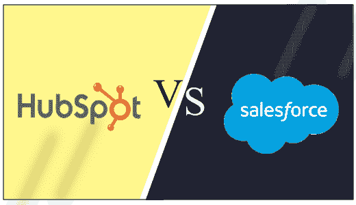

# Salesforce vs. HubSpot CRM

> 原文：<https://www.javatpoint.com/salesforce-vs-hubspot-crm>

Salesforce 和 HubSpot 拥有相似的受众和功能，但都旨在为客户提供独特的服务和不同的目的。

选择最佳且经济高效的客户关系管理可以促进组织的业务和增长，同样，选择低效的客户关系管理可能会对您的业务产生严重影响。因此，在所有可用的客户关系管理系统中选择最适合特定业务的系统总是令人困惑。

对于 [CRM](https://www.javatpoint.com/salesforce-crm) 的选择， [Salesforce](https://www.javatpoint.com/salesforce) 是各种组织的首选，因为它提供了全球排名第一的 CRM 平台。但是对于最好的客户关系管理来说，还有什么其他的选择或竞争对手呢？所以答案之一将是 HubSpot CRM。

在本主题中，我们将比较两个评级较高的客户关系管理平台，即 HubSpot 和 Salesforce 客户关系管理，以便根据业务需求轻松选择其中的最佳平台。

## Salesforce CRM 提供了什么？

Salesforce CRM 旨在为所有类型的企业提供服务，根据企业规模和需求定制解决方案。这是一款功能强大的软件，任何组织都可以使用它来运营和发展业务。Salesforce 提供各种优势和功能；其中一些如下:

*   **机会管理**
*   **账户管理**
*   **任务管理**
*   **案例管理**
*   **合同管理**

## HubSpot CRM 提供什么？

HubSpot 提供了一套营销和销售工具来帮助组织管理销售线索，并使销售团队与部门的其他成员保持同步。

与其他客户关系管理系统相比，HubSpot 客户关系管理系统还自动化了各种营销活动，并提供了许多其他营销工具。客户关系管理有一个直观的销售仪表板，销售团队可以遵循和理解。

团队可以在仪表板上看到实时统计数据，这有助于了解团队在销售中的当前位置。

还有聊天功能，领导可以和团队联系，可以互相交流。

## HubSpot 客户关系管理与 Salesforce 客户关系管理的共同特征比较

### 1.用户界面和设置

HubSpot 易于使用，但与 Salesforce 相比，它的定制和菜单选项有限。

Salesforce 和 HubSpot 都包含类似的结构，可以通过用户屏幕顶部菜单栏的帮助快速导航到联系人、客户、潜在客户和报告。人们可以很容易地获得每个客户关系管理平台中的特定联系人、电子邮件地址、电话号码和各种活动的历史记录。

与 HubSpot 相比，Salesforce 提供了许多定制选项，例如可以为报价、文件、任务和销售组等项目添加的新选项卡以及各种标准选项卡。

Salesforce 还为客户提供专门的客户经理和实施专家，但设置实施在初始阶段很复杂。

另一方面，与 Salesforce 相比，HubSpot 提供了简单的实现，因为基本版本是免费的，不需要经历销售过程、初始付款或合同。

### 2.定价

HubSpot CRM 的定价适合需要基本 CRM 功能的小型企业。相比之下，Salesforce 是需要完整功能或更高级 CRM 功能的小型到大型企业的绝佳选择。

Salesforce 和 HubSpot 都有不同的定价模型，业务的需求可以决定合适的模型。

Salesforce 根据访问平台的用户数量，按月向客户收取订阅费(按年计费)。对于 Salesforce 中的每种业务类型和要求，订阅费都是不同的。你付出的越多，你得到的功能就越多。

另一方面，HubSpot 向无限用户免费提供其主要的 CRM 平台。要添加附加功能，用户可以购买。Salesforce 的一些高级功能，如报告和仪表板，需要在 HubSpot 中单独购买。

### 3.潜在客户生成、捕获和管理

销售线索管理和评分可以使用 Salesforce 进行高度定制。然而，小企业可以通过 HubSpot 的内容营销轻松地与潜在客户一起运营。

HubSpot 主要专注于入站和内容营销。它还提供了一个使用 HubSpot 作为内容管理系统来发布白皮书和博客的选项。但是，要将 HubSpot 用作内容管理系统，客户需要额外付费。

在 Salesforce 中，要执行此类活动，客户需要单独的服务，如与 CRM 集成的 Marketo。

这两种客户关系管理都包含主要的销售线索捕获功能。当客户在网站或博客上进行任何新的查询时，该功能允许我们将客户的联系信息自动导入系统。

这两个客户关系管理系统还通过客户关系管理系统或使用电子邮件服务应用程序(如 Gmail)直接向联系人发送电子邮件。

### 4.仪表板和报告

说到强大的销售活动报告和预测，Salesforce 比 HubSpot 强得多。

最有用的客户关系管理软件功能之一是报告和分析，它分析客户的数据。对任何组织来说，监控销售并预测未来的销售情况都是至关重要的。现阶段是什么阶段？未来的增长会是怎样的？还有更多这样的问题可以用客户关系管理软件来解决。

Salesforce 和 HubSpot 都使其用户能够在仪表板上开发报告，例如使用地理区域的机会、提供有价值交易的最佳销售线索等。

在 Salesforce 中，有多种功能和选项可用于增强报告功能。有了这些功能，报告可以很容易地转换成有吸引力的仪表板。

然而，HubSpot 的基本客户关系管理只有各种销售活动和渠道的预建报告。如果您想使用 HubSpot 的高级报告包，它仍然有 200 个仪表板的限制，并且与 Salesforce 相比，包含的定制选项要少得多。

Salesforce 和 HubSpot 都提供了各种有用的报告来开始使用报告和仪表板。尽管如此，Salesforce 还是比 HubSpot 大得多，因为它还提供了各种选项来查看仪表板上的报告数据，例如使用饼图、里程表等。

简而言之，如果有人想专注于客户的数据收集和与客户的沟通，而不是报告，那么 HubSpot 是一个很好的选择。但是，如果有人需要数据分析来提高销售额，Salesforce 是最佳选择。

### 5.管道管理

对于复杂的销售流程，销售团队是最佳选择。但是对于销售周期简单的小企业来说，HubSpot CRM 还是不错的。

对于管道管理，Salesforce 提供了各种定制选项来配置交易阶段。它还提供了在管道的后期添加引线的灵活性。

而在 HubSpot 中，用户可以编辑和添加已经存在或预先配置的销售渠道阶段。这些预先配置的阶段包括预约、合格、预定演示、决策者、合同发送、已完成的成功/失败，并且每个组织允许一个管道。意思是如果公司对一个产品有一个销售流程，对其他产品有其他销售流程，那么 HubSpot 是不会允许的；您需要购买插件或高级 HubSpot 来获得多个管道。但是高级版本也没有 Salesforce 包含的那么多功能。

在 Salesforce 中，每个交易阶段都与文档相关联，不同数量的产品与每个交易相关联，并且随着交易的进行执行自动化任务。

在 HubSpot 中，一些任务可以随着销售周期自动化，但是在其他功能中，如会计和库存，这并不容易。

### 6.支持和培训

Salesforce 向所有客户提供标准支持包。该套餐包括客户成功社区，允许客户在线提出与产品相关的投诉或罚单，确保 2 天的响应时间。其高级计划提供 24*7 电话支持、一名专门的支持经理，并保证对任何关键问题做出一小时响应。

另一方面，HubSpot CRM 也为客户提供类似的标准服务台支持。客户也可以采取优质的支持和技术；支付额外费用的援助。免费用户还会在 24 小时内收到针对任何基本产品问题的适当回复。

简而言之，如果某人对基本的客户关系管理功能的支持需求较少，他可以选择 HubSpot，否则销售团队将是最佳选择。

### 7.工作流程和文档

当我们谈论销售终结时，批准是最后的要求。同样在这种数字化中，虚线上的签名仍然是必需的。一旦销售完成，就需要批准、签署和返回各种数量的文档，而且这项任务完成得越快，我们就能越快地进行下一次销售。为此，Salesforce 是最佳选择，因为它可以非常轻松地自动化此工作流和文档，并将所有与销售相关的文档存储在云存储中。Salesforce 提供了轻松创建、定制和编辑销售流程工作流的能力。

另一方面，HubSpot 提供了卓越的工作流功能，但需要购买。它提供了主要的拖放过程，但是与 salesforce 定制相比，HubSpot 工作流要少得多。对于超过 250MB 的存储，用户需要购买升级。

### 8.职能部门(销售、支持和营销)之间的协作

销售、营销和支持等不同职能部门之间的协作对于企业获得最佳结果至关重要。

Salesforce 和 HubSpot 都包含销售、营销和服务团队功能，所有功能的各种特性都可以根据业务需求进行协作。

HubSpot 包含其销售、营销和服务套件，它们保持在同一个屋顶上。它增强了一致的用户体验，因为数据、报告和其他单独的工具是相似的，并且可以工作。

另一方面，与 HubSpot 相比，Salesforce 提供了更多的产品和工具，但是维护和可用性很困难。

### 9.可量测性

客户关系管理需要按照要求发展；这意味着 CRM 功能应该是可扩展的。

在 HubSpot 中，人们可以从免费计划开始，包括基本的客户关系管理功能，并可以随着业务的增长升级这些功能。

在 Salesforce 中，软件的可扩展性和定制化是没有止境的。它包括当前对任何业务未来需求的需求。

### 10.综合

HubSpot 和 Salesforce 之间最常见的比较抱怨之一是，与 Salesforce 相比，HubSpot 只提供了有限的集成产品。

HubSpot 仍在致力于集成，它一直发展到目前为止的 153 个工具集成，包括数据传输、移动应用、电子商务集成、销售线索管理等工具。HubSpot 的应用程序市场包含 500 多个集成，可以轻松地与其他应用程序(如吉拉、Slack 等)进行设置。

另一方面，Salesforce 提供了各种应用集成和内置功能，它们可以高效地协同工作，并增强 CRM 工具的功能。它还提供了一些现成的应用程序和组件，需要任何开发人员将其集成到系统中。

## 结论:

根据上述功能的比较，我们可以得出结论，如果企业是中小型企业，具有基本的客户关系管理功能和易用性，请选择 HubSpot。

如果企业规模较大，并且以经济高效的方式满足大量定制和客户关系管理功能需求，则应该选择 Salesforce 客户关系管理解决方案。

一些企业还需要 HubSpot 和 Salesforce 来建立不同工具之间的集成。

* * *