# 谷歌云平台教程

> 原文：<https://www.javatpoint.com/google-cloud-platform>

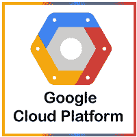

我们的谷歌云平台教程包含了谷歌云平台的基本和高级概念。本教程旨在帮助初学者和专业人士。

本教程向您介绍了谷歌云平台以及广泛的主题，如**为什么使用谷歌云平台、谷歌云平台的优势、谷歌云平台的关键功能、谷歌云平台服务、在谷歌云平台上创建免费的层帐户和虚拟机实例、**等。

在开始学习谷歌云平台之前，我们先来了解一下‘云计算’:

## 什么是云计算？

[云计算](https://www.javatpoint.com/cloud-computing-tutorial)定义为通过互联网上的远程服务器提供的服务。这些服务可能包括数据库存储、应用程序、计算能力和其他 IT 资源。远程服务器允许用户在互联网或基于云的平台上保存、修改或处理数据，而不是将其存储在本地服务器或他们的设备上。

云计算由于快速的性能、更好的可管理性和更少的维护而不断发展。它帮助组织最大限度地减少资源数量和总体基础架构成本。此外，它帮助信息技术团队更好地专注于重要的应用程序、服务和流程，并实现公司的目标。

通常，云计算提供商根据以下三种标准模式提供服务:

*   [平台即服务(PaaS)](https://www.javatpoint.com/platform-as-a-service)
*   [软件即服务(SaaS)](https://www.javatpoint.com/software-as-a-service)
*   [基础设施即服务(IaaS)](https://www.javatpoint.com/infrastructure-as-a-service)

## 什么是谷歌云平台？

谷歌云平台(GCP)是谷歌提供的一套云计算服务。它是一个公共云计算平台，由计算、存储、网络、应用程序开发、大数据等各种服务组成，运行在谷歌内部用于其最终用户产品的相同云基础架构上，如谷歌搜索、照片、Gmail 和 YouTube 等。

软件开发人员、云管理员和信息技术专业人员可以通过互联网或专用网络连接访问 GCP 的服务。

## 为什么选择谷歌云平台？

谷歌云平台被誉为 [IT](https://www.javatpoint.com/it-full-form) 领域的领先云提供商之一。几乎没有技术知识的软件开发人员和用户可以轻松访问和使用这些服务和功能。谷歌在竞争对手中一直名列前茅，为实时环境中构建、测试和部署应用程序提供了高度可扩展和最可靠的平台。

除此之外，2018 年，GCP 被宣布为 Gartner 的 IaaS 魔力象限中的领先云平台。Gartner 是领先的研究和咨询公司之一。Gartner 组织了一场活动，将谷歌云平台与其他云提供商进行比较，GCP 被选为市场前三大提供商之一。

大多数公司使用数据中心是因为成本预测、硬件确定性和高级控制的可用性。但是，他们缺乏运行和维护数据中心资源的必要功能。另一方面，GCP 是一个功能齐全的云平台，包括:

*   **容量**:足够的资源，以便在需要时轻松扩展。此外，有效管理这些资源以获得最佳性能。
*   **安全**:多级安全选项，保护资源，如资产、网络、OS -components。
*   **网络基础设施**:物理、后勤和人力资源相关组件的数量，如布线、路由器、交换机、防火墙、负载平衡器等。
*   **支持**:安装、维护、支持的熟练专业人员。
*   **带宽**:峰值负载的合适带宽量。
*   **设施**:其他基础设施组件，包括物理设备和电力资源。

因此，谷歌云平台对于企业来说是一个可行的选择，尤其是当企业需要具有全球认可的广泛服务目录时。

## 谷歌云平台的优势

谷歌云平台的一些主要优势解释如下:

**最佳定价**:谷歌让用户以最便宜的价格获得谷歌云托管。托管计划不仅比其他托管平台便宜，而且比其他平台提供更好的功能。GCP 为用户提供了一个现收现付的选项，用户只需为他们想要使用的服务和资源单独付费。

**从任何地方工作**:一旦在 GCP 配置了账户，就可以从任何地方访问。这意味着用户可以在不同地方的不同设备上使用 GCP。这是可能的，因为谷歌提供基于网络的应用程序，允许用户完全进入 GCP。

**私网**:谷歌有自己的网络，用户可以对 GCP 功能有更多的控制。因此，用户可以通过网络实现流畅的性能和更高的效率。

**可扩展**:用户通过专网获得了一个更具可扩展性的平台。因为谷歌使用光纤电缆来扩展其网络范围，它可能会有更多的可扩展性。谷歌一直在努力扩大其网络规模，因为任何时候都可能有任何流量。

**安全**:谷歌有大量的安全专业人员在工作。他们总是试图保护网络和服务器上存储的数据。此外，谷歌使用一种算法来加密云平台上的所有数据。这向用户保证，他们的数据是完全安全的，不会受到未授权来源的影响。

**冗余备份**:谷歌通过内置的冗余备份集成，始终保持用户数据的备份。万一用户丢失了存储的数据，问题不大。谷歌总是有用户数据的副本，除非数据被强制删除。这增加了 GCP 的数据完整性、可靠性和耐用性。

## 谷歌云平台的关键特性

以下是谷歌云平台的一些关键功能:

*   **按需服务**:基于网络工具的自动化环境。因此，获取资源不需要人为干预。
*   **广阔的网络访问**:资源和信息可以从任何地方访问。
*   **资源池**:计算资源共享池对用户的按需可用性。
*   **快速弹性**:无论何时需要，都有更多资源可用。
*   **计量服务**:易付费功能，用户只需为消费的服务付费。

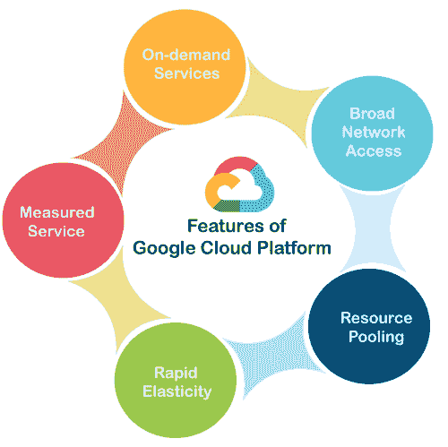

## 谷歌云平台的工作

当一个文件上传到谷歌云时，唯一的元数据被插入到一个文件中。它有助于识别不同的文件，并跟踪任何特定文件的所有副本所做的更改。个人所做的所有更改都会自动同步到主文件，也称为主文件。GCP 进一步使用元数据更新所有下载的文件，以保持正确的记录。

让我们用一个普通的例子来理解 GCP 的工作:

假设微软办公在云上实现，让几个人一起工作。使用云技术的主要目的是同时处理同一个项目。一旦我们为微软办公套件安装了插件，我们就可以在云上创建和保存一个文件。这将允许几个人同时编辑一个文档。所有者可以将访问权限分配给特定的人，以允许他们在微软办公软件中下载并开始编辑文档。

一旦用户被指定为编辑器，他们就可以根据需要使用和编辑文档的云副本。生成的合并编辑副本称为主文档。GCP 帮助给不同用户的现有文档的每个特定副本分配一个唯一的 [URL](https://www.javatpoint.com/url-full-form) 。但是，任何授权用户的更改都将显示在通过云共享的所有文档副本上。如果对同一文档进行了多次更改，那么 GCP 允许所有者选择要保留的适当更改。

## 谷歌云平台服务

谷歌提供了相当多的具有几个独特功能的服务。这就是谷歌云平台不断在全球扩张的原因。GCP 的一些重要服务包括:

*   计算服务
*   [联网](https://www.javatpoint.com/networking-interview-questions)
*   存储服务
*   大数据
*   安全和身份管理
*   管理工具
*   云人工智能
*   物联网

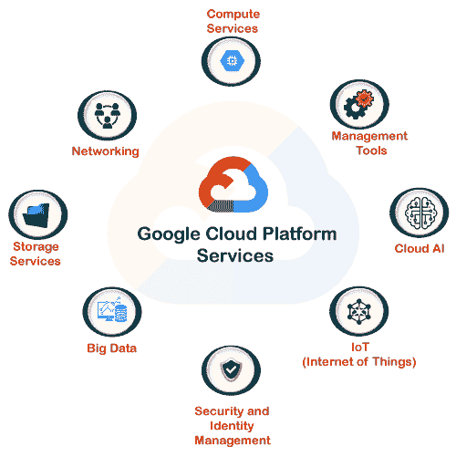

让我们详细了解这些服务:

### 计算服务

GCP 提供一系列可扩展的计算服务，例如:

*   **谷歌 App Engine** :是一个遵循平台即服务理念部署 PHP、Java 等软件的云计算平台。它还用于在谷歌管理的数据中心开发和部署基于网络的软件。谷歌应用引擎最显著的优势是其自动缩放能力。这意味着当请求增加时，应用程序引擎会自动为应用程序分配更多资源。
*   **计算引擎**:它是一个云计算平台，遵循基础设施即服务的理念，运行基于 Windows 和 Linux 的虚拟机。它是 GCP 的重要组成部分。它是在谷歌搜索引擎、YouTube 和其他谷歌服务使用的相同基础设施上设计的。
*   **Kubernetes Engines** :这个计算服务负责提供一个平台，用于跨主机集群的应用程序容器的自动部署、扩展和其他操作。该引擎支持几个容器工具，如 docker 等。

### 建立关系网

GCP 包括以下网络服务:

*   **VPC** : VPC 代表虚拟专用网。VPC 的主要功能是提供带有路由、IP 分配和网络防火墙策略的专用网络。这将有助于为应用程序部署创建一个安全的环境。
*   **云负载均衡**:顾名思义，云均衡就是将工作负载分布在不同的计算资源上，以平衡整个系统的性能。这也导致成本降低。该过程还有助于最小化资源的可用性和最大化资源的能力。
*   **内容交付网络** : CDN 是代理服务器及其数据中心的地理分布网络。使用 CDN 的主要目的是为用户提供最大的性能。此外，通过将相关服务平均分配给最终用户，它还有助于提供资源的高可用性。

### 存储服务

GCP 有以下存储服务:

*   **谷歌云存储**:是谷歌向其用户提供的在线数据存储 web 服务，可以从任何地方存储和访问数据。该服务还包括广泛的功能，如最高性能、可扩展性、安全性和共享。
*   **云 SQL** :它是一种网络服务，使用户能够创建、管理和使用存储在谷歌云服务器上的关系数据库。该服务本身维护和保护数据库，这有助于用户专注于他们的应用程序和其他操作。
*   **云 Bigtable** :以性能快、可管理性强著称。这是一项高度可扩展的 NoSQL 数据库服务，允许收集和保留低至 1 TB 至数百 PB 的数据。

### 大数据

GCP 提供各种与大数据相关的服务；它们是:

*   **BigQuery** :是谷歌全托管的数据分析服务。谷歌大查询服务的主要目的是帮助企业分析大数据。它提供了高度可扩展的数据管理选项。这意味着 BigQuery 允许用户执行特定的查询，并在网络上共享数据见解。
*   **谷歌云数据存储**:谷歌云数据存储是一种完全托管、无模式、非关系的数据存储服务。这项服务使企业能够执行自动交易和丰富的查询。谷歌云数据存储的主要优势是自动扩展的能力。这意味着服务本身可以根据资源的需求进行上下扩展。
*   **谷歌云 Dataproc** :是谷歌提供的一款非常快速易用的大数据服务。它主要帮助管理用于分布式数据处理的 Hadoop 和 Spark 服务。该服务允许用户创建根据总体工作负载调整大小的 Hadoop 或 Spark 集群，并且可以随时访问。

### 安全和身份管理

GCP 包括以下与安全和身份管理相关的服务:

*   **云数据防丢失 API** :主要用于管理敏感数据。它帮助用户管理敏感数据元素，如信用卡详细信息、借记卡详细信息、护照号码等。它为敏感数据提供了快速且可扩展的分类。
*   **云 IAM** :代表云身份和访问管理。它是一个包含规则和策略的框架，用于验证用户访问技术资源的身份验证。这就是为什么它也被称为身份管理(IdM)。

### 管理工具

GCP 包括以下与管理工具相关的服务:

*   **Google stack driver**:Google stack driver 服务主要负责显示整体性能和诊断信息。这可能包括对数据监控、跟踪、记录、错误报告等的见解。该服务还向公共云用户提示警报通知。
*   **谷歌云控制台应用**:是一款由谷歌提供动力的原生移动应用。这项服务的主要目的是让用户能够随时随地从移动设备直接管理谷歌云服务的核心功能。该服务的主要功能是警报、监控和对资源执行关键操作。

### 云人工智能

说到云人工智能，GCP 提供以下服务:

*   **云机器学习引擎**:是另一个完全托管的服务，允许用户创建机器学习模型。该服务主要用于那些基于主流框架的 ML 模型。
*   **Cloud AutoML** :是基于机器学习的服务类型。它帮助用户输入他们的数据集，并获得高质量的训练有素的预先设计的 ML 模型。这项服务遵循谷歌的迁移学习和神经架构搜索方法。

### 物联网

GCP 包含以下物联网服务:

**云物联网核心**:是全托管核心服务之一。它允许用户从安全连接到互联网的各种设备连接、控制和摄取数据。这使得其他谷歌云服务能够实时分析、处理、收集和可视化物联网数据。

**云物联网边缘**:边缘计算服务将内存和其他计算能力资源带到需要的位置附近。

## 谷歌云平台的优势

使用谷歌云平台有几个优势，例如:

*   **谷歌云提供快速便捷的协作**:多个用户可以访问数据，同时贡献自己的信息。这是可能的，因为数据存储在云服务器上，而不是用户的个人计算机上。
*   **持续发展带来更高的生产力**:谷歌一直致力于增加新的特性和功能，为客户提供更高的生产力。因此，谷歌经常更新其产品和服务。
*   **采用新功能带来更少的中断**:谷歌每周提供小更新，而不是推动巨大的颠覆性变化更新。这有助于用户轻松理解和采用新功能。
*   **最少或最少的数据存储在易受攻击的设备上**:除非用户明确尝试，否则谷歌不会在本地设备上存储数据。这是因为与云的数据相比，存储在本地设备上的数据可能会受到损害。
*   **用户可以从任何地方访问谷歌云**:最好的一点是，用户可以从任何地方轻松访问存储在谷歌云上的信息，因为它是通过基于网络的应用程序进行操作的。
*   **谷歌以其强大的结构**提供最大的安全性:谷歌雇佣领先的安全专业人员来保护用户的数据。用户可以获得谷歌基于流程的物理安全功能。
*   **用户拥有对其数据的完全控制权**:用户获得对服务和存储在谷歌云的数据的完全控制权。如果用户不想再使用谷歌服务，想删除云数据，可以很容易地执行。
*   **谷歌提供更高的正常运行时间和可靠性**:谷歌利用多种资源提供更高、更可靠的启动时间服务器。如果数据中心因技术问题无法正常工作，系统将自动与辅助中心通信，而不会中断用户可见的通信。

## 在 GCP 创建免费等级账户

要开始使用谷歌云平台，我们首先需要创建一个帐户 GCP。在这里，我们将创建一个免费的层帐户来解释本教程即将到来的主题。免费账户最好的一点是，谷歌提供价值 300 美元的信用额度，在账户创建之日后的 90 天内使用。在接下来的 90 天里，谷歌用一个免费账户提供 GCP 的所有核心服务。

但是，用户必须有信用卡才能开设免费的分级账户。谷歌要求提供信用卡的详细信息，以确保这是一个真正的人类请求。即使过了 90 天或者我们用完了 300 美元的免费点数，谷歌也不会自动收费。只有当我们将免费账户手动升级为付费账户时，才会收取该金额。

让我们从在谷歌云平台上创建免费层帐户的步骤开始:

**第一步**:首先我们需要导航到以下链接:[https://cloud.google.com/gcp/](https://cloud.google.com/gcp/)

**第二步**:在下一屏，我们需要点击‘免费入门’，如下图:

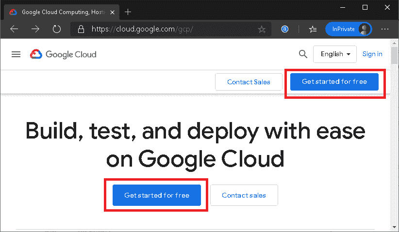

**第三步**:接下来，我们需要登录谷歌账号。如果我们没有现有的谷歌帐户，我们可以使用“创建帐户”按钮。

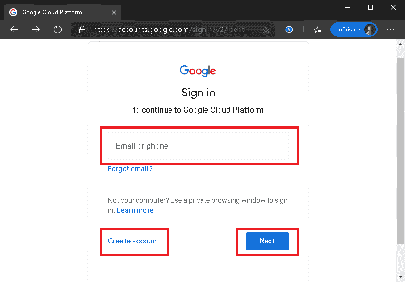

**第四步**:登录后，会出现如下画面:

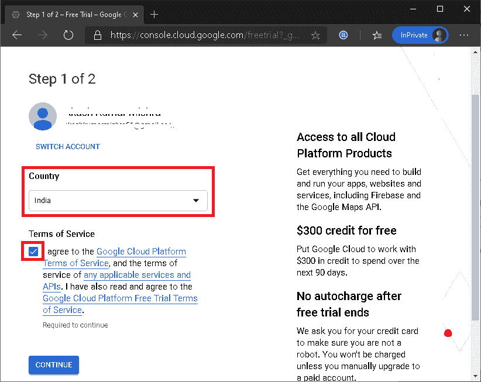

在这里，我们必须选择国家，同意服务条款，然后点击“继续”按钮。

**第五步**:在下一个画面中，我们要输入一些必要的细节，比如姓名和地址的细节。此外，我们必须输入付款方式和信用卡详细信息等付款详细信息。填写完所有详细信息后，我们需要点击页面底部的“开始我的免费试用”按钮:

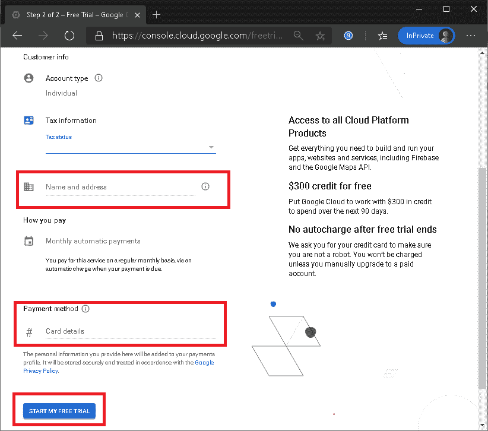

**第六步**:谷歌要求确认使用信用卡进行小额扣款，确保卡信息正确。但是，该金额会退回到同一帐户。在这里，我们需要点击“CONTINUE”按钮:

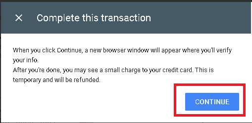

**第 7 步**:在下一屏，我们必须点击‘转到控制台’按钮:

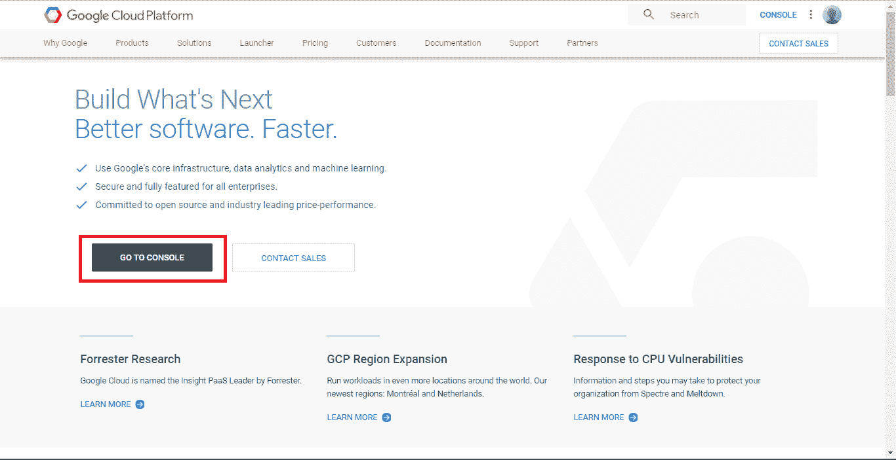

单击“转到控制台”按钮后，我们将被重定向到仪表板，其中包括 GCP 服务摘要以及项目和其他见解。看起来是这样的:

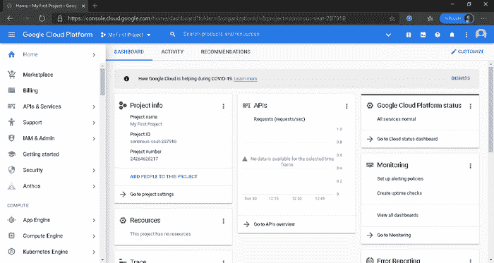

具体来说，GCP 的仪表板显示以下内容的汇总视图:

*   **项目信息**:包含项目名称、ID、编号等项目详细信息。
*   **资源**:包含相关项目正在使用的资源列表。
*   **API**:包含与项目一起运行的各种 API 请求(以请求/秒的形式)。
*   **谷歌云平台状态**:显示属于 GCP 的服务的整体概要。
*   **监控**:显示告警、性能统计、正常运行时间等。以确保系统可靠运行。
*   **错误报告**:显示项目中出现的错误，但需要先配置。
*   **Trace** :显示分布式跟踪系统中现有应用的延迟数据。
*   **计算引擎**:以百分比(%)显示对 CPU 使用的洞察。
*   **教程**:包含入门指南(基本指南)来解释 GCP 功能是如何工作的。
*   **新闻**:显示关于谷歌云平台的新闻和其他重要更新。
*   **文档**:包含深入的指南，介绍更多关于计算引擎、云存储和应用引擎的知识。

## 谷歌云平台定价

说到定价，谷歌云平台是市场上最便宜的解决方案。GCP 不仅价格低廉，而且比其他供应商提供更多的功能和服务。

将 GCP 与其他主要竞争对手相比，它比它们更有优势。谷歌为用户节省了 60%的费用，包括:

*   15%的调整建议
*   21%的标价差异
*   持续使用折扣的 24%

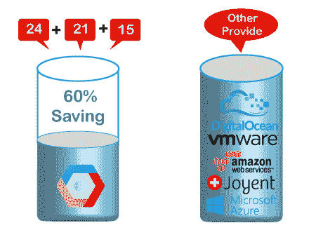

GCP 定价的一些主要好处是:

**无隐性收费**:GCP 定价背后无隐性收费。谷歌的定价结构简单易懂。

**现收现付**:谷歌为客户提供了‘现在使用，以后支付’的选项。因此，用户只需为他们想使用或已经使用的服务付费。

**无终止费**:用户可以随时自由停止使用谷歌服务，不需要支付任何终止费。这意味着用户停止使用谷歌服务的那一刻；他们停止支付。

## 谷歌云平台、AWS 和 Azure 的区别

和谷歌云平台一样，AWS 和 Azure 是其他流行的基于云的平台。然而，它们之间存在差异。GCP、 [AWS](https://www.javatpoint.com/aws-tutorial) 和 [Azure](https://www.javatpoint.com/microsoft-azure) 之间的一些主要差异如下表所示:

| 谷歌云 | 自动警报系统 | Azure的 |
| 它使用 GCE(谷歌计算引擎)进行计算。 | AWS EC2 提供核心计算服务。 | 它使用虚拟机进行计算。 |
| 它使用谷歌云存储进行存储。 | 它使用亚马逊 S3 存储数据。 | 它使用包含用于存储数据的块的存储块 bob。 |
| 它为客户提供了最低的价格来击败其他云提供商。 | AWS 定价通常渴望有不可思议的东西。颗粒定价的整体结构有点复杂。 | 和 AWS 一样，Azure 的定价结构也很难理解，除非你有相当的经验。 |
| 它使用云测试实验室进行应用测试。 | 它使用设备场进行应用程序测试。 | 它使用开发测试实验室进行应用测试。 |
| 它使用子网作为虚拟网络。 | 它使用 VPC 作为虚拟网络。 | 它使用虚拟网络作为虚拟网络。 |
| 它遵循云负载平衡配置。 | 它遵循弹性负载平衡配置。 | 它遵循负载平衡器应用程序网关配置。 |

## GCP 的工作机会

对谷歌云平台有一点深入的了解对工作非常有用。然而，一次使用 GCP 的经验或多一点的专业知识会帮助一个人在人群中脱颖而出。这不仅会让简历更有效，还会打开各种各样的工作机会。

GCP 有很多工作机会。下面列出了一些常见的工作角色:

*   技术主管经理
*   销售工程师
*   技术解决方案工程师
*   客户经理
*   技术项目经理
*   云软件工程师
*   数据中心软件工程师
*   解决方案架构师
*   战略客户工程师

## 先决条件

这个 GCP 教程没有特别的先决条件。你所需要的只是不断学习和使用工具练习。但是，如果您想要扩展功能以满足您的需求，那么使用基于云的软件和工具的基本知识将是有益的，并使您处于优势。我们设计了本教程，帮助您从头开始学习谷歌云平台的所有概念。

## 观众

我们的谷歌云平台教程旨在帮助初学者和专业人士。

## 问题

我们向您保证，通过我们的谷歌云平台教程学习时，您不会发现任何困难。但是如果您在本教程中发现任何错误，我们请求您将问题发布在联系表中，以便我们进行改进。

* * *